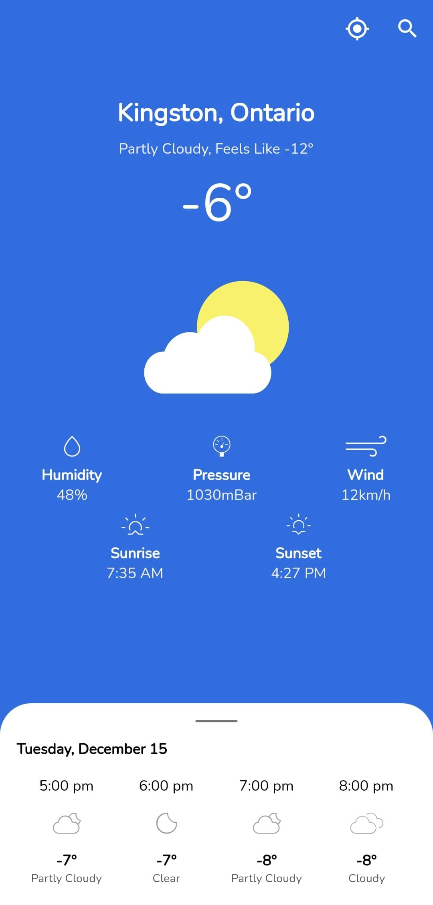
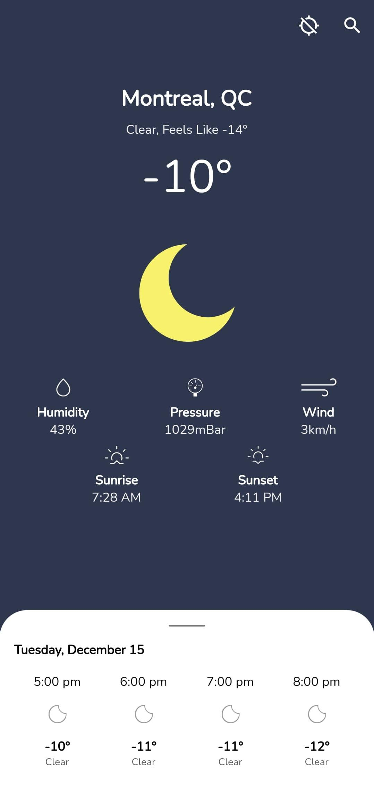
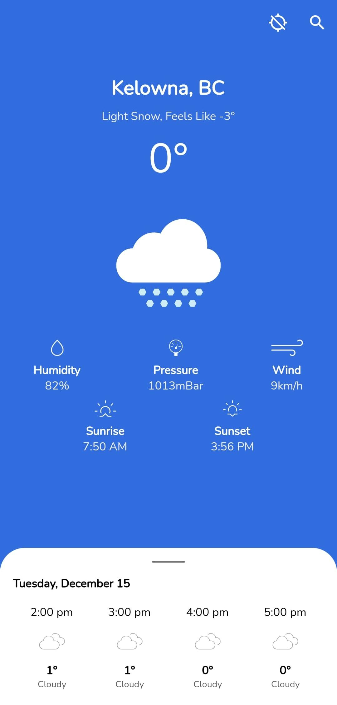
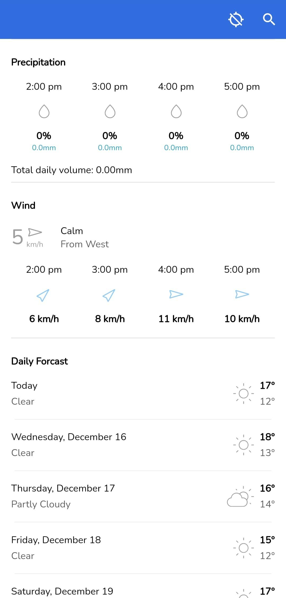
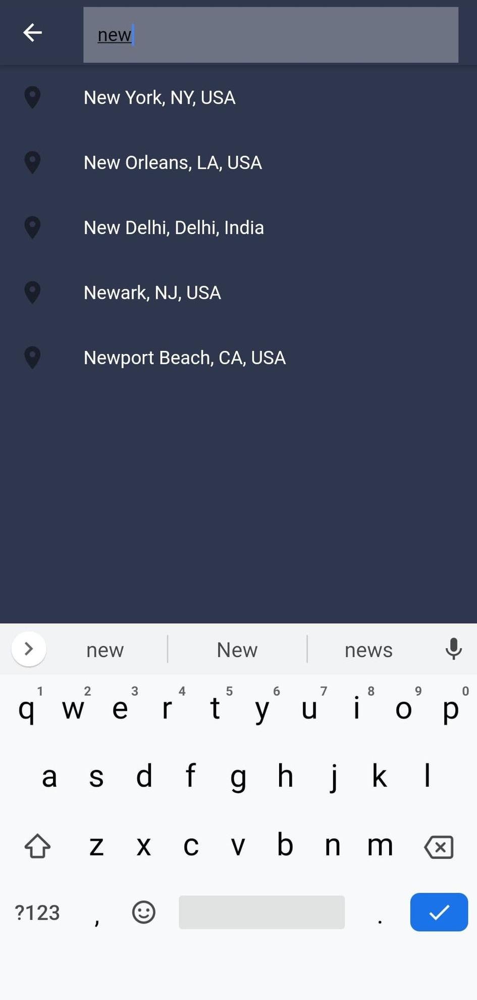

# Flutter-Weater-App

If you don't think there is to many weather apps in the world, here's another one... Built with Flutter, implemented for Android and IOS.

  

 

## Packages Used

* [flutter_google_places](https://pub.dev/packages/flutter_google_places)
* [geocoder](https://pub.dev/packages/geocoder)
* [geolocator](https://pub.dev/packages/geolocator)
* [pull_to_refresh](https://pub.dev/packages/pull_to_refresh)
* [flutter_svg](https://pub.dev/packages/flutter_svg)

## Services Used

* [OpenWeatherMap API](https://openweathermap.org/api) for all weather data
* [Google Places & Geocoding API](https://cloud.google.com/maps-platform/) for city information

## Screenshots

       

 

Most assets created by me (Peter McLay) in Adobe Illustrator.

Some icon assets used from Erik Flowers [here](https://erikflowers.github.io/weather-icons/)
